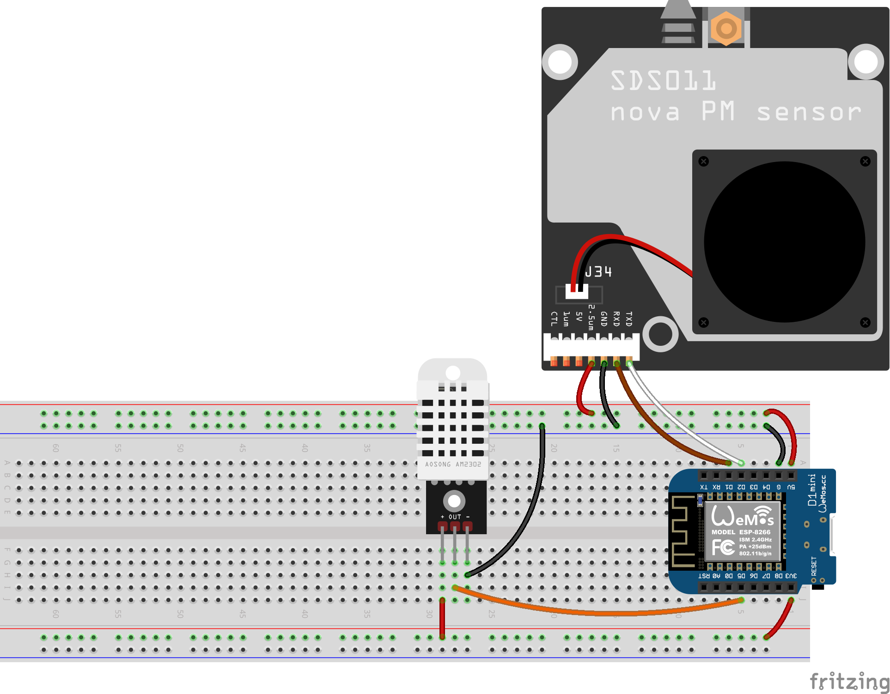
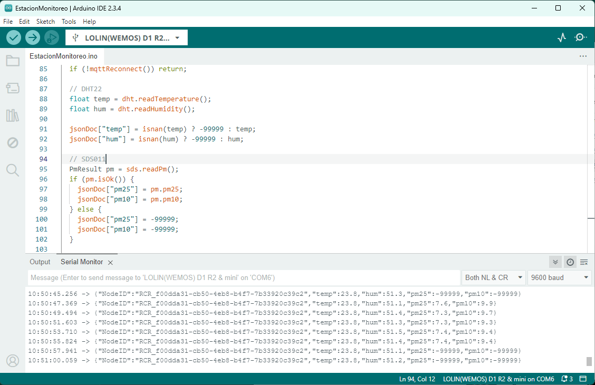

# Estación de monitoreo de calidad del aire

- Microcontrolador: Wemos D1 Mini
- Sensor de calidad de aire: SDS011
- Sensor de humedad y temperatura: DHT22

 

 

Documentos:

- Potential and Limitations of the Low-Cost SDS011 Particle Sensor for Monitoring Urban Air Quality by Budde, et al
- Field performance of a low-cost sensor in the monitoring of particulate matter in Santiago, Chile" by Tagle, et al
